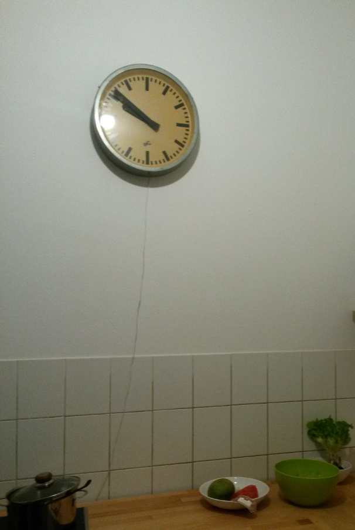
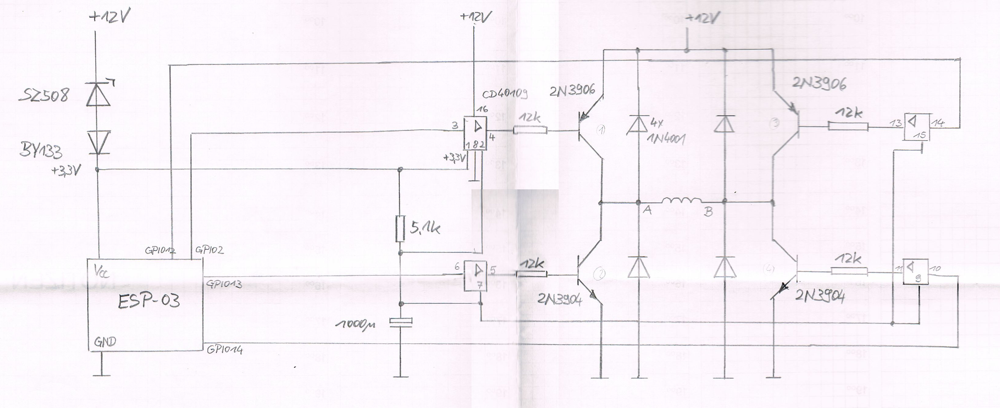
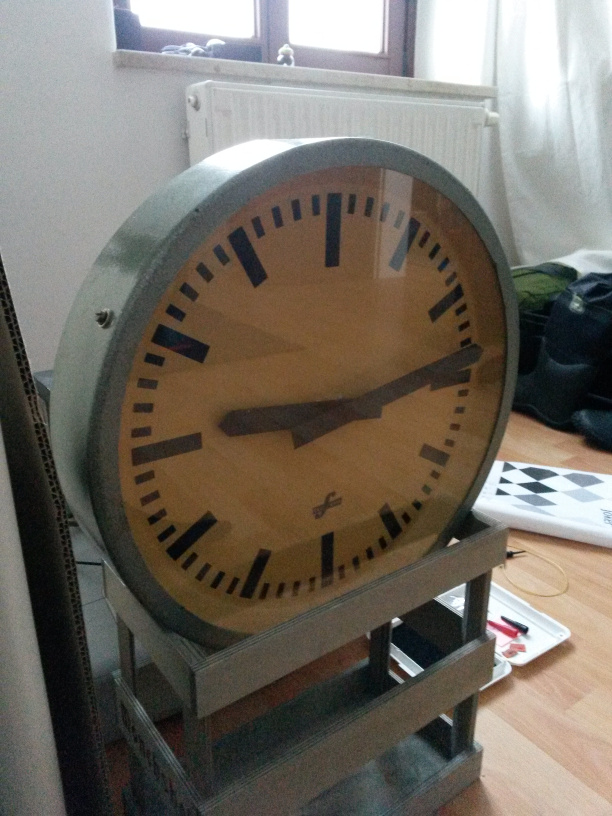
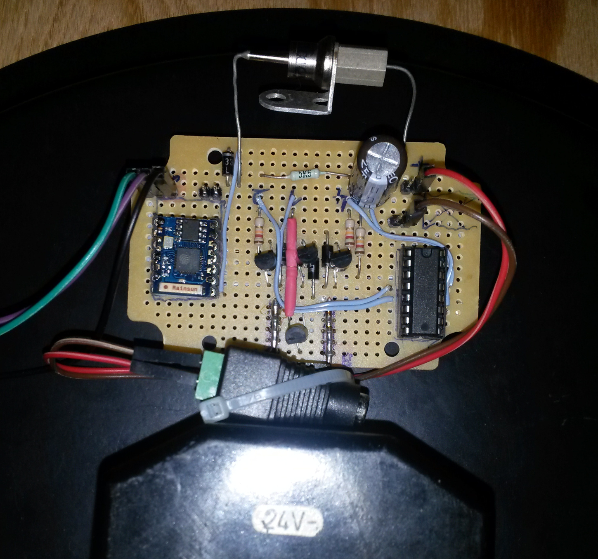

# Elfema NTP Clock



I saved this clock from the trash. This is a clock manufactured from the GDR company called [Elfema](http://www.elektrouhren-freaks.de/elektrouhren/firmengeschichten/elfema/index.php). It's a slave clock from a [clock network](https://en.wikipedia.org/wiki/Clock_network) system. Since the original master clock is too bulky, here is a updated version with new nifty features:

* NTP based time synchronisation
* HTTP-Interface
* automatic daylight saving time
* 12V power supply

## Hardware

Used components:

* [ESP-03](http://www.esp8266.com/wiki/doku.php?id=esp8266-module-family#esp-03) (ESP8266)
* 2N3906 Transitor
* CD40109 Low-to-High Voltage Level Shifter
* 1N4001 Diode
* SZ508 Zener Diode
* BY133 Diode
* ‥ some resistors and a capacitor

Equipment:

* USB-to-Serial Adapter for programming (e.g. CP2102)

### Schematic

Scan of the sketched schematic.



### Images

The Elfema clock front.



The soldered board with the ESP-03 board (ESP8266) on the backside.

 

## Build

Install [platformio](http://platformio.org/) and checkout the repository.

```
$ echo -e "myssid\tsupersecretwifipassword" > secret
$ source env/activate               # set $PLATFORMIO_BUILD_FLAGS
$ platformio run --target upload    # build and upload to ESP8266
```

## Use

Power up the clock and wait some seconds. The clock indicates complete network and time setup by moving the minute clockhand. Now tell the clock it's current clockhand settings.

```
# determine the ip adress, here it's 192.168.42.106
$ curl "192.168.42.106/time"  # check the clock time
ntp time and date: 23:46:11 27.10.2016
# read the clockhands
$ curl "192.168.42.106/set?H=18&M=24"
ok got it!
```

After that the clock will set itself to the current time. Please do **not** use this in public / unsecure network environment. Otherwise someone is going to mess up the time and clock.

## Ideas

* add a spare AM2302 sensor on GPIO16
* Secure HTTP interface with challenge-response authentication
* [OTA Updates](http://docs.platformio.org/en/stable/platforms/espressif8266.html#over-the-air-ota-update)
* build some nifty mobile app ([apache cordova](https://cordova.apache.org/)?)
